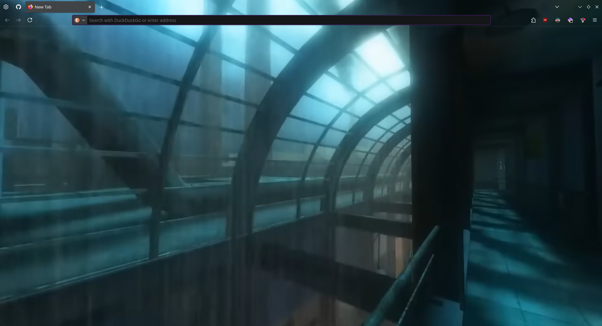

# Firefox-Global-Image-Theme
A fully transparent Firefox setup with one global background image behind all UI and content areas. \

---
## Requirements
- **Firefox 128+**

---
## Setup Guide
### 1. Enable Custom CSS Support
Open `about:config` and set:

| Preference | Value | Purpose |
|------------|-------|----------|
| `toolkit.legacyUserProfileCustomizations.stylesheets` | `true` | Enables `userChrome.css` & `userContent.css` |
|`browser.tabs.allow_transparent_browser` | `true` | allows transparent background for window |
---

### 2. Locate Your Profile Folder

Open `about:support` then click **Open Folder** under **Profile Folder**.

Create a subfolder called `chrome` if it doesn’t exist.

---

### 3. Clone/Copy the Files
#### Cloning
cd into the `chrome/` directory
`git clone https://github.com/bearofbusiness/Firefox-Global-Image-Theme.git .`
#### Copying
Download the zip using the green code button at the top. Then unzip it then put it into the indevidual files into the `chrome/` you just created.
```tree
<some-letters and numbers>.default-release
└── chrome
    ├── theme_frame3.png
    ├── theme_frame.png
    ├── userChrome.css
    └── userContent.css

```

### 4. Configuring
By default there is no image if you want to add one add an image you need call it `theme_frame.png` and put it in `chrome/` 
```tree
<some-letters and numbers>.default-release
└── chrome
    ├── theme_frame.png
    ├── userChrome.css
    └── userContent.css
```
If your image is a different format you can edit `userChrome.css` at `background-image: url("put image name here") !important;` \
Lastly if you are on linux and you want a fully transparent window you can comment out the entire `#main-window` block at the bottom of `userChrome.css` using `/*` at the start and `*/` at the end.
```css
#main-window {
    background-image: url("theme_frame.png") !important;
    background-repeat: no-repeat !important;
    background-position: center center !important;
    background-size: cover !important;
    background-attachment: fixed !important;
}
```
> [!NOTE]  
> I have not tested on Windows. I have read that there are extra things you have to do for full transparent but I do not use Windows and the person I made this for wanted an image background.

### 5. Restart Firefox
Once you close and open Firefox you are done!! 🎉🥳🎉

## Uninstallation
### 1. Delete `chrome/`
Open `about:support` then click **Open Folder** under **Profile Folder** and remove the `chrome/` folder.
### 2. Disable Custom CSS Support
Open `about:config` and input each string and either click the button with the left arrow button ⬅️ or the trash can button 🗑️.(depends on the input type)
- `toolkit.legacyUserProfileCustomizations.stylesheets`
- `browser.tabs.allow_transparent_browser`


