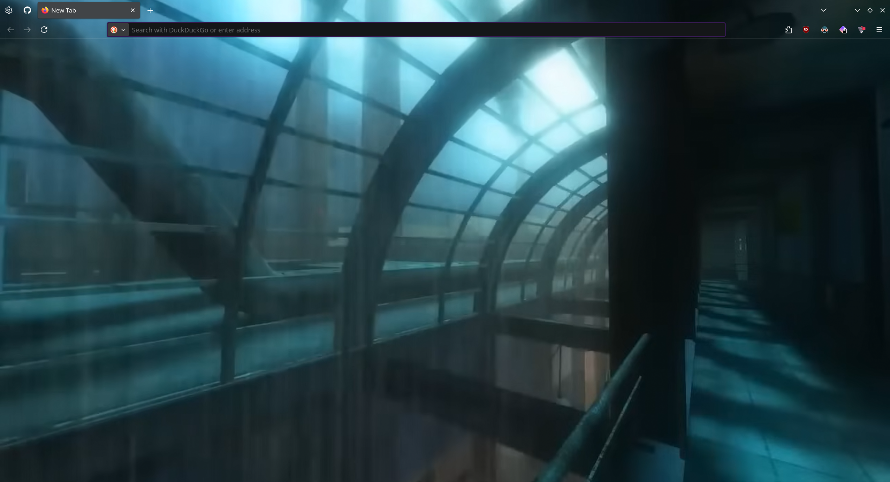

# Firefox-Global-Image-Theme
A fully transparent Firefox setup with one global background image behind all UI and content areas. \

---
## Requirements
- **Firefox 128+**

---
## Setup Guide
### 1. Enable Custom CSS Support
Open `about:config` and set:

| Preference | Value | Purpose |
|------------|-------|----------|
| `toolkit.legacyUserProfileCustomizations.stylesheets` | `true` | Enables `userChrome.css` & `userContent.css` |
| `browser.display.background_color` | `	#000000` | Transparent default page background |
| `browser.display.background_color.dark` | `	#000000` | Transparent default page background |
| `browser.display.use_system_colors` | `false` | Prevent GTK/system colors from painting |
| `layout.css.prefers-color-scheme.content-override` | `0` | Follow system scheme instead of forcing dark |
| `widget.non-native-theme.use-theme-accent` | `true` | Allow CSS-based themes to override system |
> [!NOTE]  
> I dont think you need `browser.display.background_color` and `browser.display.background_color.dark`
---

### 2. Locate Your Profile Folder

Open `about:support` then click **Open Folder** under **Profile Folder**.

Create a subfolder called `chrome` if it doesn’t exist.

---

### 3. Clone/Copy the Files
#### cloning
cd into the `chrome/` directory
`git clone https://github.com/bearofbusiness/Firefox-Global-Image-Theme.git .`
#### copying
download the zip unzip it then put it into the `chrome/` you just created.

### 4. Configuring
By default there is no image if you want to add one add an image you need call it `theme_frame.png` and put it in `chrome/` \
If your image is a different format you can edit `userChrome.css` at `background-image: url("put image name here") !important;` \
Lastly if you are on linux and you want a fully transparent window you can comment out the entire `#main-window` block at the bottom of `userChrome.css`
```css
#main-window {
    background-image: url("theme_frame.png") !important;
    background-repeat: no-repeat !important;
    background-position: center center !important;
    background-size: cover !important;
    background-attachment: fixed !important;
}
```
> [!NOTE]  
> I have not tested on Windows. I have read that there are extra things you have to do but I do not use Windows and the person I made this for wanted an image background.

### 5. Restart Firefox
Once you close and open Firefox you are done!! 🎉🥳🎉

## Uninstallation
### 1. Delete `chrome/`
Open `about:support` then click **Open Folder** under **Profile Folder** and remove the `chrome/` folder.
### 2. Disable Custom CSS Support
Open `about:config` and input each string and either click the button with the left arrow button ⬅️ or the trash can button 🗑️.(depends on the input type)
- `toolkit.legacyUserProfileCustomizations.stylesheets`
- `browser.display.background_color`
- `browser.display.background_color.dark`
= `browser.display.use_system_colors`
- `layout.css.prefers-color-scheme.content-override`
- `widget.non-native-theme.use-theme-accent`


